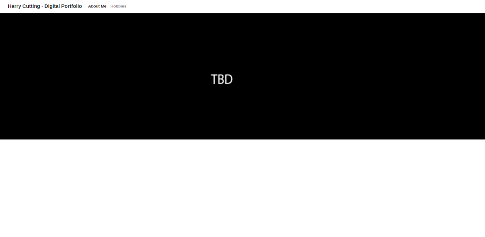
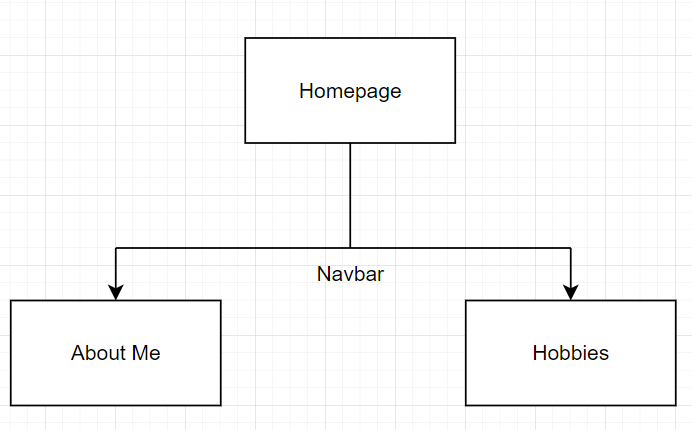
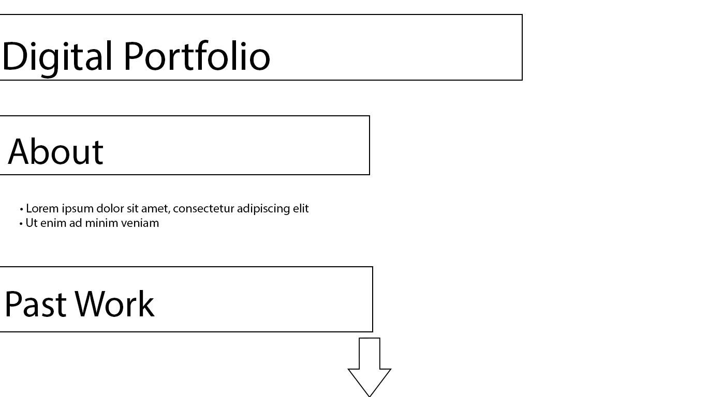

# Portfolio Design

## Audience & Purpose
The main audience my portfolio is aimed towards is employers, people that will use this portfolio to consider my merit and potential to bring me onto an employment position.

Its purpose is to sell myself to these employers and also neatly present all of my lifes work so far in one compact place. The purpose of an early design is to have a visualization of this place early in development and to note flaws that can be improved upon with a new design idea.

## Designs
### Storyboard #1

This was my original design, which was a reskinned version of my website from the last work unit
- It contains a large banner on the homepage
- A navbar going to different pages showing different information
### Navigation Chart

### Storyboard #2 (Chosen)

This is my second design, which is my final choice
- This design consists of a single page that you scroll down 

This final decision will fulfil the stated purpose by compactly presenting everything I've done to an employer viewing it. The design will also meet the needs of the audience by somewhat taking the form of a CV, where its just a continuous page of information rather than branched off to multiple pages.