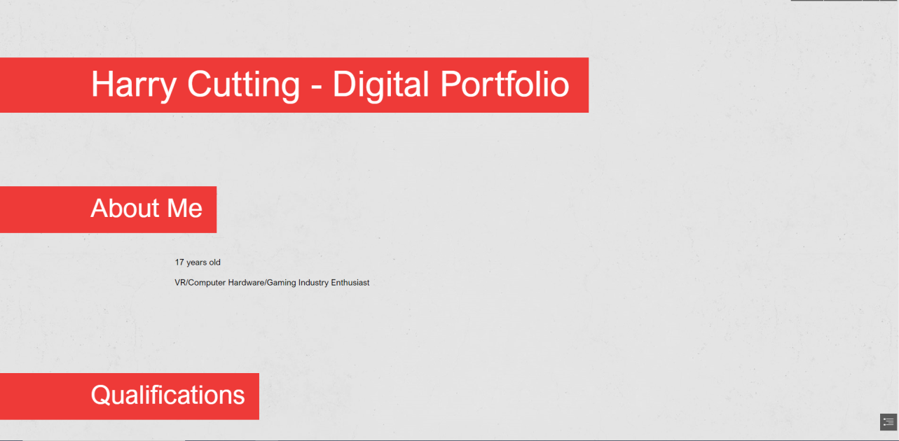

# Portfolio evaluation and justification according to brief
## Intended audience and purpose fulfillment 
My portfolio is suitable for it's intended audience (employers) by providing all of my credentials and qualifications in one place to allow them to consider me for a job role.

> Its purpose is to sell myself to these employers and also neatly present all of my lifes work so far in one compact place.

This purpose is fulfilled

## Evaluation

My final portfolio contains a variety of content, such as
+ Images
+ Hotlinks 

## Design Comparison
### Concept

### Final

**Comparison**

+ The concept design takes on the form of a website with multiple pages rather than the single page the final portfolio is on
+ I made this change for the betterment of the audience, to make my portfolio easier to navigate and to make it familiar to a CV rather than a website.